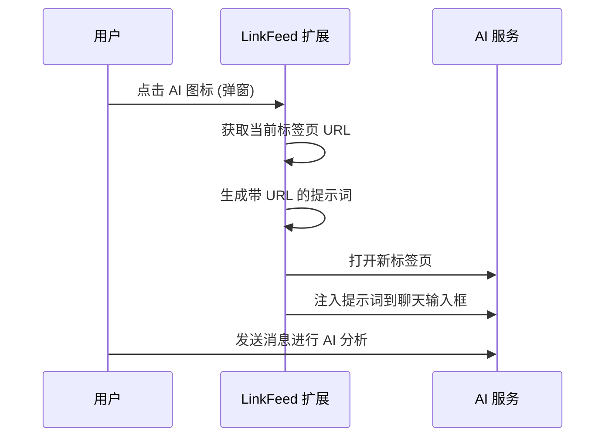

# LinkFeed

> 🌉 Don't copy-paste, just feed it. (别复制粘贴，直接喂给它。)

**LinkFeed** 是一款 Chrome 扩展程序，可立即将当前网页 URL 注入到流行的 AI 聊天服务中，让您无需手动复制粘贴即可利用 AI 进行网页内容分析。

## ✨ 功能特性

- **一键投喂 URL** - 点击任一 AI 服务图标，即可打开并自动填入当前网页 URL
- **支持 9 大 AI 服务**：
  - ChatGPT
  - Claude
  - Gemini
  - DeepSeek
  - Kimi
  - 豆包 (Doubao)
  - Grok
  - 千问 (Qianwen)
  - 元宝 (Yuanbao)
- **智能自动注入** - 自动填充 AI 聊天输入框，带重试逻辑（10秒超时，每500ms重试）
- **剪贴板回退** - 如果自动注入失败，自动将提示词复制到剪贴板
- **拖拽排序** - 可自由拖拽调整 AI 服务图标顺序，排列顺序自动保存
- **双语支持** - 中英文界面一键切换，自动检测浏览器语言
- **深色模式支持** - 适配系统主题偏好
- **无障碍访问** - 完整的 ARIA 标签与键盘导航支持

## 📸 工作原理



## 🚀 安装指南

### 从源码安装（开发者）

1. 克隆此仓库：
   ```bash
   git clone https://github.com/huangli1279/linkfeed.git
   cd linkfeed
   ```

2. 打开 Chrome 并访问 `chrome://extensions/`

3. 启用 **开发者模式** (右上角开关)

4. 点击 **加载已解压的扩展程序** 并选择 `linkfeed` 目录

5. 扩展程序图标现在应该出现在你的工具栏中

## 📁 项目结构

```
linkfeed/
├── manifest.json              # Chrome 扩展清单文件 (V3)
├── background.js              # Service worker - 处理事件与注入
├── popup/
│   ├── index.html             # 弹窗 UI 结构
│   ├── popup.js               # 弹窗逻辑、AI 网格渲染与拖拽排序
│   └── style.css              # 弹窗样式（支持深色模式）
├── content-scripts/
│   ├── injector.js            # DOM 注入与重试逻辑
│   └── config/
│       ├── selectors.js       # AI 服务配置与 DOM 选择器
│       └── README.md          # 配置说明文档
├── icons/                     # 扩展图标 (16, 48, 128px PNG)
├── assets/
│   ├── ai-logos/              # AI 服务品牌图标 (SVG)
│   └── logos/                 # LinkFeed 品牌 Logo 素材
├── _locales/
│   ├── en/
│   │   └── messages.json      # 英文翻译
│   └── zh_CN/
│       └── messages.json      # 简体中文翻译
└── docs/
    ├── prd.md                 # 产品需求文档
    ├── store_justifications.md# Chrome Web Store 提交说明
    └── privacy.html           # 隐私政策
```

## ⚙️ 配置

AI 服务在 `content-scripts/config/selectors.js` 中配置：

```javascript
export const AI_SERVICES = {
  chatgpt: {
    id: 'chatgpt',
    name: 'ChatGPT',
    url: 'https://chatgpt.com',
    selector: '#prompt-textarea',       // 输入框 CSS 选择器
    icon: 'assets/ai-logos/chatgpt.svg',
    enabled: true
  },
  kimi: {
    id: 'kimi',
    name: 'Kimi',
    url: 'https://www.kimi.com',
    selector: 'div.chat-input-editor[contenteditable="true"]',
    icon: 'assets/ai-logos/kimi.svg',
    domains: ['kimi.moonshot.cn', 'kimi.com', 'kimi.ai'], // 多域名支持
    enabled: true
  },
  // ... 更多服务
};
```

### 添加新的 AI 服务

1. 在 `selectors.js` 的 `AI_SERVICES` 中添加条目
2. 在 `manifest.json` 的 `host_permissions` 和 `content_scripts.matches` 中添加该服务的 URL
3. 添加图标 SVG 到 `assets/ai-logos/`

## 🔐 权限说明

本扩展程序通过最小权限原则申请以下权限：

| 权限 | 用途 |
|------------|---------|
| `tabs` | 读取当前标签页 URL |
| `notifications` | 显示回退通知（当注入失败时） |
| `host_permissions` | 访问 AI 服务网站以进行内容脚本注入 |

## 🛠️ 技术栈

- **Manifest V3** - 最新的 Chrome 扩展标准
- **原生 JavaScript (ES2021+)** - 使用 ES Modules，无需构建步骤
- **Chrome Extension APIs** - tabs, notifications, i18n
- **纯前端** - 无 npm 依赖，无构建工具，直接加载即可运行

## 📖 使用指南

### 通过弹窗使用
1. 浏览任意网页
2. 点击 LinkFeed 扩展图标
3. 选择您偏好的 AI 服务（可拖拽调整顺序）
4. AI 服务网页将打开并自动预填好 URL

### 语言切换
- 弹窗右上角提供 EN/CN 切换按钮
- 首次使用时自动检测浏览器语言
- 语言偏好会自动保存

### 提示词模板

扩展程序使用中英文双语提示词模板，引导 AI 扮演资深讲师角色来讲解网页内容：

> **英文：** "Read this web page: [URL]. I would like you to act as a patient Senior Lecturer..."
>
> **中文：** "请阅读这个网页：[URL]。我希望你扮演一位耐心的资深讲师..."

## 🐛 故障排除

| 问题 | 解决方案 |
|-------|----------|
| 提示词未自动填充 | 扩展程序会回退到剪贴板 - 请手动粘贴 (Ctrl/Cmd + V) |
| AI 服务不工作 | 检查 `selectors.js` 中的 DOM 选择器是否需要更新 |
| 扩展图标消失 | 从 `chrome://extensions/` 重新加载扩展 |
| 语言显示异常 | 点击弹窗右上角 EN/CN 按钮手动切换 |

## 📄 许可证

MIT License

## 🤝 贡献参与

1. Fork 本仓库
2. 创建特性分支 (Feature branch)
3. 提交 Pull Request
