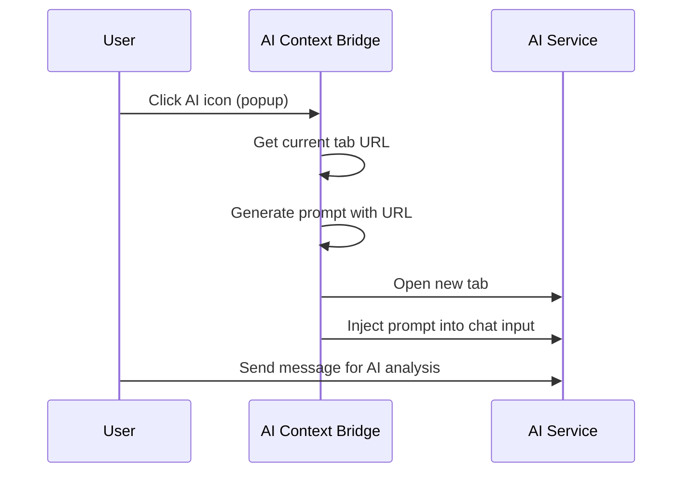

# LinkFeed

> 🌉 Don't copy-paste, just feed it. (别复制粘贴，直接喂给它。)

**LinkFeed** (formerly LinkHelper) is a Chrome extension that instantly injects your current webpage URL into popular AI chat services, enabling AI-powered web content analysis without manual copy-pasting.

## ✨ Features

- **One-Click URL Feeding** - Click any AI service icon to open it with your current page URL pre-filled

- **6 AI Services Supported**:
  - ChatGPT
  - Claude
  - Gemini
  - DeepSeek
  - Kimi
  - 豆包 (Doubao)
- **Smart Auto-Injection** - Automatically fills AI chat input with retry logic (10s timeout)
- **Clipboard Fallback** - Copies prompt to clipboard if auto-injection fails
- **Dark Mode Support** - Adapts to system theme preferences

## 📸 How It Works



## 🚀 Installation

### From Source (Developer)

1. Clone this repository:
   ```bash
   git clone https://github.com/yourusername/link-helper.git
   cd link-helper
   ```

2. Open Chrome and navigate to `chrome://extensions/`

3. Enable **Developer mode** (toggle in top right)

4. Click **Load unpacked** and select the `link-helper` directory

5. The extension icon should now appear in your toolbar

## 📁 Project Structure

```
link-helper/
├── manifest.json              # Chrome Extension manifest (V3)
├── background.js              # Service worker - handles events & injection
├── popup/
│   ├── index.html             # Popup UI structure
│   ├── popup.js               # Popup logic & AI grid rendering
│   └── style.css              # Popup styles (dark mode support)
├── content-scripts/
│   ├── injector.js            # DOM injection with retry logic
│   └── config/
│       └── selectors.js       # AI service configurations & DOM selectors
├── icons/                     # Extension icons (16, 48, 128px SVG)
├── assets/
│   └── ai-logos/              # AI service brand icons
└── docs/
    └── prd.md                 # Product Requirements Document
```

## ⚙️ Configuration

AI services are configured in `content-scripts/config/selectors.js`:

```javascript
export const AI_SERVICES = {
  chatgpt: {
    id: 'chatgpt',
    name: 'ChatGPT',
    url: 'https://chatgpt.com',
    selector: "textarea[id='prompt-textarea']",
    enabled: true
  },
  // ... more services
};
```

### Adding a New AI Service

1. Add entry to `AI_SERVICES` in `selectors.js`
2. Add the service URL to `host_permissions` in `manifest.json`
3. Add icon SVG to `assets/ai-logos/` (optional)

## 🔐 Permissions

The extension requests minimal permissions:

| Permission | Purpose |
|------------|---------|
| `tabs` | Read current tab URL |
| `scripting` | Inject content scripts into AI sites |
| `notifications` | Show fallback notifications |

| `host_permissions` | Access AI service websites |

## 🛠️ Tech Stack

- **Manifest V3** - Latest Chrome Extension standard
- **Vanilla JavaScript (ES2021+)** - ES Modules, no build step
- **Chrome Extension APIs** - tabs, scripting, contextMenus, notifications

## 📖 Usage

### Via Popup
1. Navigate to any webpage
2. Click the AI Context Bridge extension icon
3. Select your preferred AI service
4. The AI service opens with your URL pre-filled


### Prompt Template

The extension uses this prompt template:
> "Read this web page content: [URL]. I need to ask you questions based on it..."

## 🐛 Troubleshooting

| Issue | Solution |
|-------|----------|
| Prompt not auto-filled | Extension falls back to clipboard - paste manually |
| AI service not working | Check if DOM selector needs updating in `selectors.js` |
| Extension icon missing | Reload extension from `chrome://extensions/` |

## 📄 License

MIT License

## 🤝 Contributing

1. Fork the repository
2. Create a feature branch
3. Submit a pull request

---

Made with ❤️ for the Vibe Coding community
