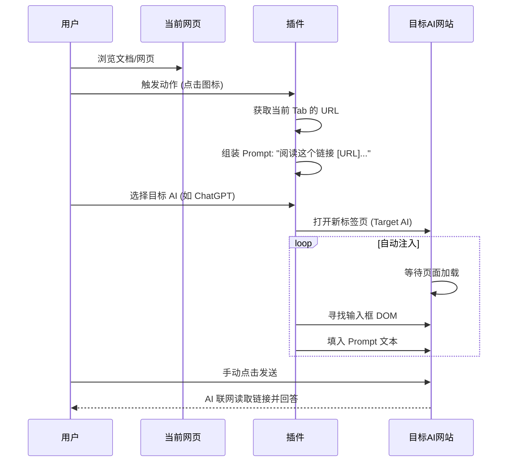

# [PRD] AI Context Bridge (AI 语境桥)

## 1. 文档概述

* **产品名称**: AI Context Bridge (内部代号：LinkHelper)
* **版本号**: V1.0
* **编写日期**: 2026-01-08

## 2. 项目背景与目标

* **背景**: Vibe Coding 兴起，小白用户缺乏阅读文档的能力，需要借助 AI 联网能力来解读在线文档。
* **目标**: 极简地将“当前页面 URL”携带至 AI 聊天框，利用 AI 自身的联网阅读能力辅助用户学习。
* **核心价值**: **快**。一键跳转，省去复制链接、打开 AI、粘贴链接、写提示词的繁琐步骤。

## 3. 用户角色

* **小白开发者**: 遇到问题时，直接把文档链接扔给 AI，让 AI “嚼碎”了喂给他。

## 4. 业务流程 (Sequence Diagram)

## 5. 功能需求详情 (Functional Requirements)

### 5.1 插件弹出面板 (Popup UI)

* **界面描述**: 极简风格，无复杂配置。

* **页面元素**:
1. **Header**: 产品 Logo + 名称。
2. **AI 列表 (Grid Layout)**:
* 平铺展示支持的 AI 图标（ChatGPT, Claude, Gemini, 豆包, Kimi, DeepSeek 等）。
* *交互*: 鼠标悬停显示高亮效果。
3. **底部**: 一个小的“设置”入口（齿轮图标），用于未来扩展。

* **交互逻辑**:
* 点击任意 AI 图标 -> 执行 **[跳转注入流程]**。

### 5.3 核心逻辑：提示词生成 (Prompt Template)

* **逻辑**: 插件固定使用唯一的通用 Prompt。
* **模板内容**:
> "阅读这个网页的内容: [Current_URL] 。\n我需要基于其中的内容向你提问，请先联网解析该网页，准备好后告诉我。"

* *(注：提示词特意强调“联网解析”，引导具备联网能力的 AI 触发搜索插件)*

### 5.4 核心逻辑：跨页面注入 (Injection Script)

* **需求**: 通过 Popup 触发时执行此逻辑。
* **配置表 (DOM Selectors)**:
* **ChatGPT**: `textarea[id="prompt-textarea"]`
* **Claude**: `div[contenteditable="true"]`
* **Gemini**: `div[contenteditable="true"][role="textbox"]`
* **DeepSeek**: `` (需实际抓取最新类名)
* **Kimi**: `div[class*="editor"]` (需实际抓取最新类名)
* **豆包**: `textarea` 或对应输入框类名

* **执行步骤**:
1. 获取当前 Tab 的 `window.location.href`。
2. `chrome.tabs.create({ url: target_ai_url })`。
3. 使用 `chrome.scripting.executeScript` 注入内容脚本。
4. **重试机制**: 脚本每隔 500ms 检查一次输入框是否存在，最多尝试 20 次（10秒超时）。
5. **赋值**: 找到输入框后，填入 Prompt。
6. **事件触发**: 必须触发 `input` 和 `change` 事件，确保前端框架（React/Vue）感知到数据变化，否则发送按钮可能保持禁用状态。
7. **光标定位**: 将光标移动到文本最后，方便用户补充具体问题。

## 6. 非功能需求

* **性能**: 插件包体积需极小（< 2MB）。
* **权限**: 仅申请必要的权限：
* `tabs` (读取 URL)
* `scripting` (注入脚本)
* `host_permissions` (目标 AI 网站的访问权限)

## 7. 异常处理

* **注入失败 (兜底方案)**:
* 如果 10 秒内未找到输入框（可能是网站改版或网速过慢）。
* **动作**: 将 Prompt 自动写入系统**剪贴板**。
* **反馈**: 弹出一个简单的浏览器通知或 Alert：“自动填入失败，内容已复制到剪贴板，请手动粘贴。”