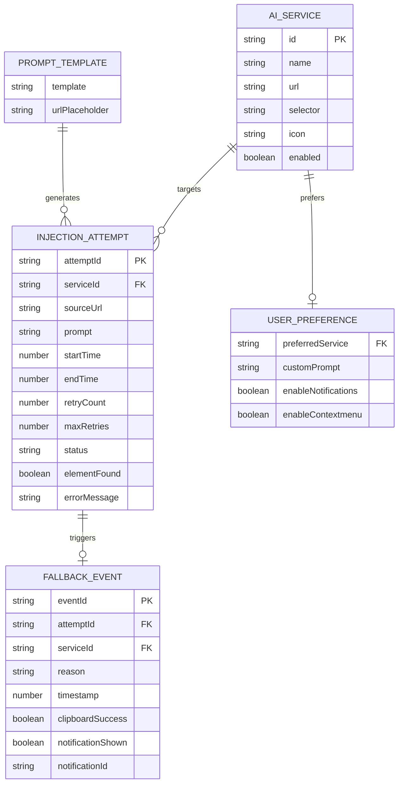
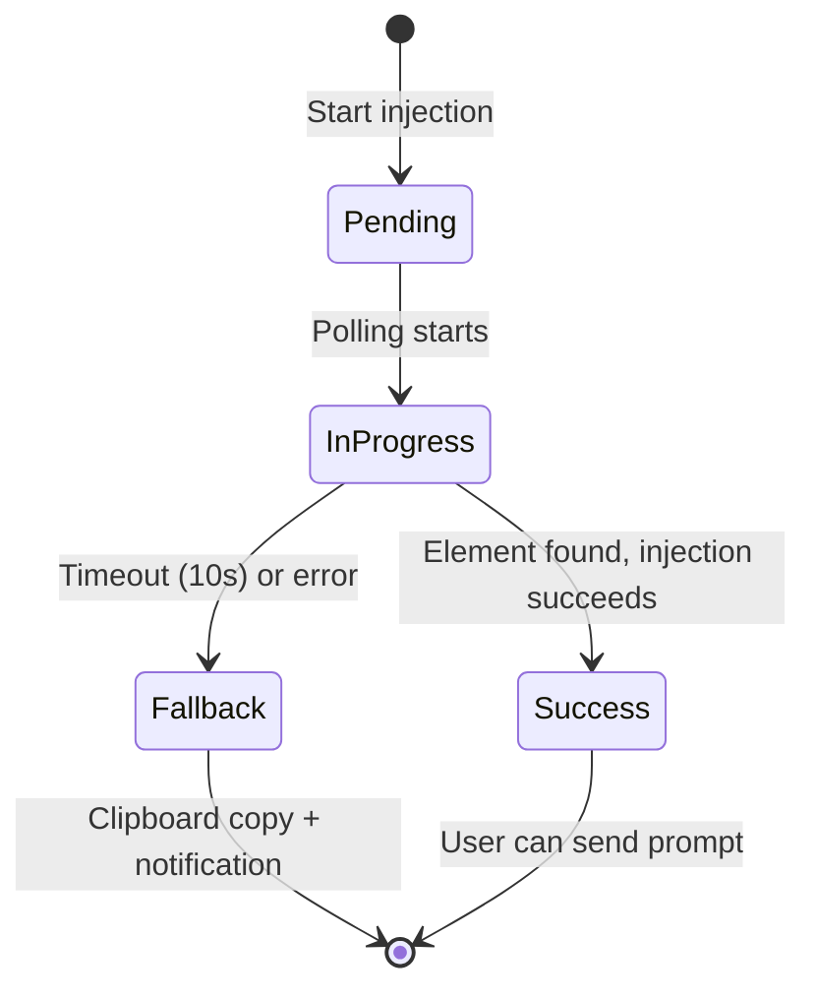

# Data Model: AI Context Bridge Chrome Extension

**Feature**: AI Context Bridge (LinkHelper)
**Date**: 2026-01-09
**Phase**: Phase 1 - Data Model & Entities

## Overview

This document defines the data entities and their relationships for the AI Context Bridge Chrome Extension. The extension has a simple data model with no persistent storage requirements (except optional user preferences via chrome.storage.sync).

## Entities

### 1. AI Service Configuration

**Description**: Represents a single AI service (e.g., ChatGPT, Claude) with its configuration for URL, DOM selector, and injection behavior.

**Attributes**:

| Attribute | Type | Description | Validation |
|-----------|------|-------------|------------|
| `id` | string | Unique identifier for the service (e.g., "chatgpt", "claude") | Required, lowercase, alphanumeric |
| `name` | string | Display name for the service (e.g., "ChatGPT", "Claude") | Required, non-empty |
| `url` | string | Base URL for the AI service (e.g., "https://chatgpt.com") | Required, valid URL |
| `selector` | string | CSS selector for the input box (e.g., "textarea[id='prompt-textarea']") | Required, valid CSS selector |
| `icon` | string | SVG icon path or inline SVG markup | Required, valid SVG |
| `enabled` | boolean | Whether the service is enabled (for future feature flags) | Default: true |

**Example**:
```javascript
{
  id: "chatgpt",
  name: "ChatGPT",
  url: "https://chatgpt.com",
  selector: "textarea[id='prompt-textarea']",
  icon: "<svg>...</svg>",
  enabled: true
}
```

**Relationships**:
- One-to-many with Injection Attempt (one service can have multiple injection attempts)
- Used in Prompt Template to generate service-specific prompts

---

### 2. Prompt Template

**Description**: The standardized text template used to generate prompts for AI services, containing a placeholder for the current tab's URL.

**Attributes**:

| Attribute | Type | Description | Validation |
|-----------|------|-------------|------------|
| `template` | string | The prompt text with [URL] placeholder | Required, contains "[URL]" placeholder |
| `urlPlaceholder` | string | The placeholder string to replace with actual URL | Default: "[URL]" |

**Example**:
```javascript
{
  template: "Read this web page content: [URL]. I need to ask you questions based on it...",
  urlPlaceholder: "[URL]"
}
```

**Derived Values**:
- `generatedPrompt` (string): The final prompt with URL replaced (computed at runtime)

**Relationships**:
- Used by Injection Attempt to generate the actual prompt text

---

### 3. Injection Attempt

**Description**: Represents a single attempt to find and inject content into an AI service's input box, including retry count, timeout status, and success/failure outcome.

**Attributes**:

| Attribute | Type | Description | Validation |
|-----------|------|-------------|------------|
| `attemptId` | string | Unique identifier for the attempt (UUID) | Required, unique |
| `serviceId` | string | Reference to AI service being targeted | Required, must match AI Service.id |
| `sourceUrl` | string | The URL of the tab where extension was triggered | Required, valid HTTP/HTTPS URL |
| `prompt` | string | The generated prompt to inject | Required, non-empty |
| `startTime` | number | Timestamp when injection attempt started (ms since epoch) | Required |
| `endTime` | number | Timestamp when injection attempt ended (ms since epoch) | Optional (null until complete) |
| `retryCount` | number | Number of retry attempts (0-20) | Required, 0 <= retryCount <= 20 |
| `maxRetries` | number | Maximum retry attempts allowed | Required, default: 20 |
| `status` | string | Current status: "pending", "in_progress", "success", "fallback" | Required, enum |
| `elementFound` | boolean | Whether the DOM element was found | Required |
| `errorMessage` | string | Error message if injection failed | Optional |

**Lifecycle**:

```
pending → in_progress → success
                   ↘ fallback
```

**Example**:
```javascript
{
  attemptId: "a1b2c3d4-e5f6-7890-abcd-ef1234567890",
  serviceId: "chatgpt",
  sourceUrl: "https://example.com/article",
  prompt: "Read this web page content: https://example.com/article. I need to ask you questions based on it...",
  startTime: 1704787200000,
  endTime: 1704787212000,
  retryCount: 3,
  maxRetries: 20,
  status: "success",
  elementFound: true,
  errorMessage: null
}
```

**Relationships**:
- Many-to-one with AI Service (each attempt targets one service)
- Triggers Fallback Event if status is "fallback"

---

### 4. Fallback Event

**Description**: Represents a failed injection that triggered clipboard fallback, including the timestamp, target service, and reason for failure.

**Attributes**:

| Attribute | Type | Description | Validation |
|-----------|------|-------------|------------|
| `eventId` | string | Unique identifier for the fallback event (UUID) | Required, unique |
| `attemptId` | string | Reference to the injection attempt that failed | Required, must match Injection Attempt.attemptId |
| `serviceId` | string | Reference to the AI service being targeted | Required, must match AI Service.id |
| `reason` | string | Reason for fallback (e.g., "timeout", "element_not_found", "injection_failed") | Required, enum |
| `timestamp` | number | Timestamp when fallback was triggered (ms since epoch) | Required |
| `clipboardSuccess` | boolean | Whether clipboard write succeeded | Required |
| `notificationShown` | boolean | Whether browser notification was shown | Required |
| `notificationId` | string | ID of the browser notification (for dismissal) | Optional |

**Example**:
```javascript
{
  eventId: "f0e1d2c3-b4a5-6789-abcd-ef1234567890",
  attemptId: "a1b2c3d4-e5f6-7890-abcd-ef1234567890",
  serviceId: "claude",
  reason: "timeout",
  timestamp: 1704787212000,
  clipboardSuccess: true,
  notificationShown: true,
  notificationId: "auto-fill-failed-123456"
}
```

**Relationships**:
- One-to-one with Injection Attempt (each fallback corresponds to one failed attempt)
- Many-to-one with AI Service (each fallback is associated with one service)

---

### 5. User Preference (Future)

**Description**: User-configurable preferences stored in chrome.storage.sync. Not used in initial version but included for future-proofing.

**Attributes**:

| Attribute | Type | Description | Validation |
|-----------|------|-------------|------------|
| `preferredService` | string | User's preferred AI service (auto-selected in popup) | Optional, must match AI Service.id |
| `customPrompt` | string | Custom prompt template (replaces default) | Optional, must contain [URL] placeholder |
| `enableNotifications` | boolean | Whether to show browser notifications | Default: true |
| `enableContextmenu` | boolean | Whether to enable context menu integration | Default: true |

**Example**:
```javascript
{
  preferredService: "chatgpt",
  customPrompt: null,
  enableNotifications: true,
  enableContextmenu: true
}
```

**Storage**: chrome.storage.sync (automatically syncs across user's devices)

---

## Entity Relationships



---

## State Transitions

### Injection Attempt State Machine



**States**:
- **Pending**: Initial state, before polling starts
- **InProgress**: Actively polling for DOM element (500ms intervals)
- **Success**: Element found, prompt injected, events triggered
- **Fallback**: Timeout or error, clipboard fallback activated

**Transitions**:
- Pending → InProgress: Immediate (when content script loads)
- InProgress → Success: When `document.querySelector(selector)` returns element
- InProgress → Fallback: When `retryCount >= maxRetries` (20 attempts × 500ms = 10s)
- Success → [*]: User sends prompt or closes tab
- Fallback → [***: Clipboard copy completes, notification shown

---

## Data Flow

### Popup Flow

1. User clicks extension icon → Popup opens (popup/index.html)
2. Popup loads AI_SERVICE configurations from config/selectors.js
3. Popup renders grid of AI service buttons
4. User clicks service button → Message sent to background.js
5. Background.js validates URL (protocol check)
6. Background.js opens new tab with AI service URL
7. Background.js injects content-script/injector.js
8. Content script creates INJECTION_ATTEMPT record (in-memory)
9. Content script polls for DOM element (PROMPT_TEMPLATE generates prompt)
10. If element found → Inject prompt, trigger events → INJECTION_ATTEMPT.status = "success"
11. If timeout → Trigger clipboard fallback → Create FALLBACK_EVENT → INJECTION_ATTEMPT.status = "fallback"

### Context Menu Flow

1. User right-clicks webpage → Context menu appears
2. User selects AI service from submenu → chrome.contextMenus.onClicked fires
3. Background.js receives event, validates URL
4. Same flow as Popup steps 6-11

---

## Validation Rules

### URL Validation (FR-006)

```javascript
function isValidUrl(url) {
  try {
    const parsed = new URL(url);
    return parsed.protocol === 'http:' || parsed.protocol === 'https:';
  } catch {
    return false;
  }
}
```

**Rules**:
- URL must parse successfully
- Protocol must be `http:` or `https:`
- Special protocols (`chrome:`, `about:`, `file:`, `edge:`) are rejected
- Invalid URLs trigger inline notification and block injection

### Selector Validation (FR-018)

```javascript
function isValidSelector(selector) {
  try {
    document.querySelector(selector);
    return true;
  } catch {
    return false;
  }
}
```

**Rules**:
- Selector must be valid CSS selector syntax
- Selector must match at least one element in the DOM
- Invalid selectors trigger fallback after timeout

### Retry Logic Validation (FR-010)

```javascript
const MAX_RETRIES = 20;
const RETRY_INTERVAL = 500; // ms
const MAX_DURATION = MAX_RETRIES * RETRY_INTERVAL; // 10,000ms = 10s
```

**Rules**:
- Retry count must not exceed 20
- Retry interval must be 500ms (not configurable)
- Maximum duration is 10 seconds (hard limit)

---

## Persistence Strategy

### In-Memory (Runtime)

**Storage**: JavaScript variables in content script context
**Entities**: INJECTION_ATTEMPT (during active injection)
**Lifetime**: Content script context (until tab closed or navigation)
**Rationale**: Injection attempts are transient, no persistence needed

### chrome.storage.sync (Future)

**Storage**: Browser's synced storage API
**Entities**: USER_PREFERENCE
**Lifetime**: Permanently (syncs across user's devices)
**Rationale**: User preferences persist across sessions and devices

### No Database

**Decision**: No database (IndexedDB, localStorage, etc.) required
**Rationale**:
- No persistent data storage needed
- All data is transient (injection attempts) or user preferences (chrome.storage.sync)
- Aligns with privacy principle (no data collection)

---

## Summary

The data model is intentionally simple with 5 entities:

1. **AI Service Configuration** (static config, 6 records)
2. **Prompt Template** (singleton, static)
3. **Injection Attempt** (transient, in-memory during injection)
4. **Fallback Event** (transient, logged for debugging)
5. **User Preference** (optional, chrome.storage.sync)

**No complex relationships** - Most entities are independent or have simple parent-child relationships.

**No persistence required** - All data is either static configuration (config/selectors.js) or transient runtime data (in-memory during injection).

**Privacy-aligned** - No user data is stored or transmitted, only browser-local preferences (future).
